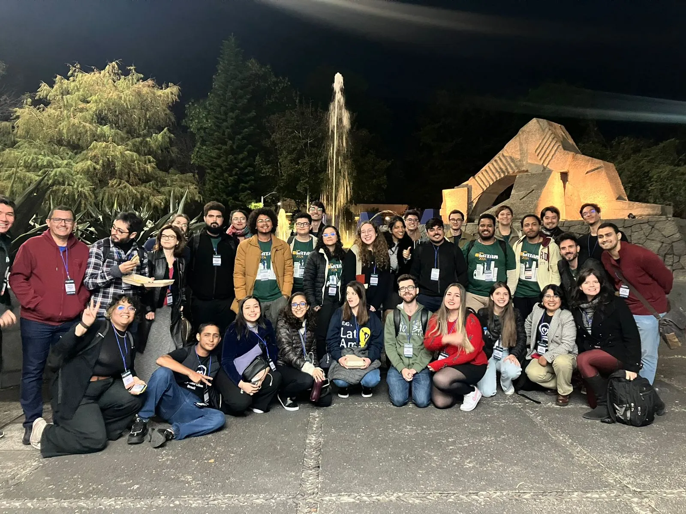

EAGxLATAM was an [effective altruism](effectivealtruism.org) event in Mexico City about ideas of existential risks, AI safety and the animal cause. There, I could talk with a lot of people that works with AI safety (e.g.: students from the [AI Futures Fellowship](aifuturesfellowship.org), researchers from groups like [FAR AI](far.ai), etc.) and watch lectures about relevant topics.

